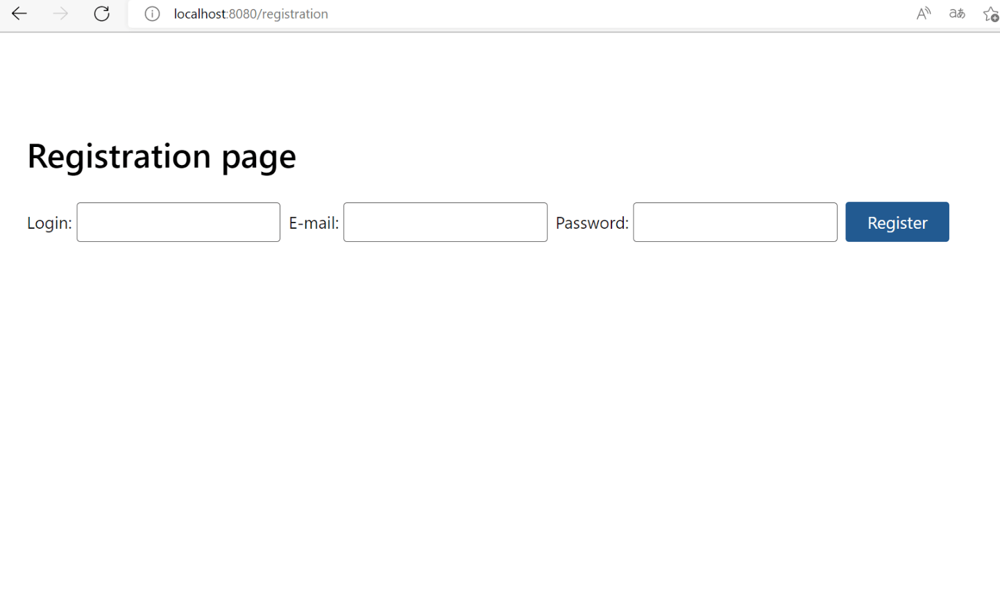
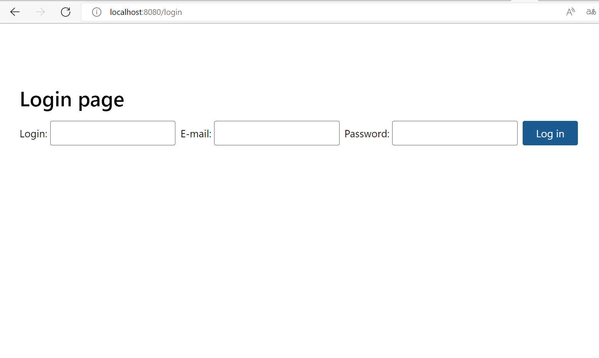
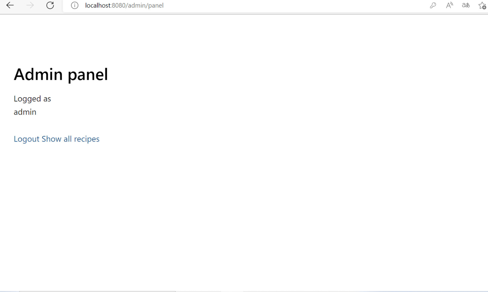
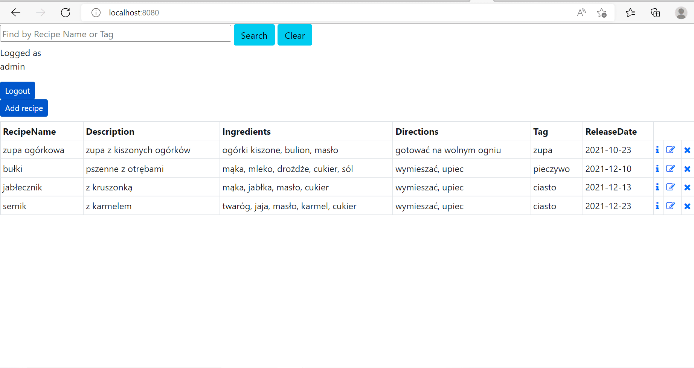
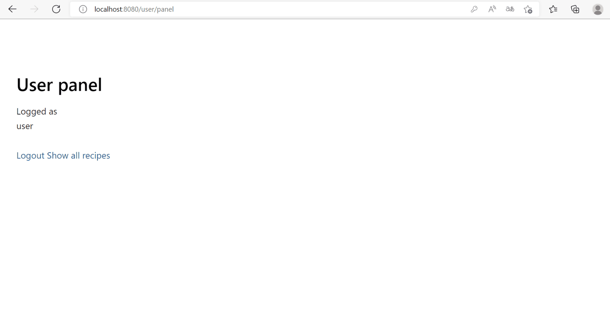
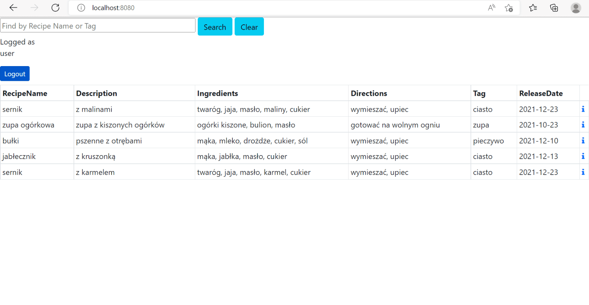

## cook-book

Web recipe storage application. Useful for small food service businesses where employees can share suggestions for new recipes and other employees can comment them.

## Tech stack

- [Spring Boot](https://spring.io/projects/spring-boot)
- [Thymeleaf](https://www.thymeleaf.org/)
- [Bootstrap_CSS](https://yegor256.github.io/tacit/)
- [MySQL](https://www.mysql.com/)

**User-Registration** -  localhost:8080/registration
 -you can enter _*your login details_ (you will be logged as user)

**User-Log in** -  localhost:8080/login
 _*admin_[login: admin, e-mail: admin@gmail.com, password: pass]
 _*user_[login: user, e-mail: user@gmail.com, password: pass]
 _*your login details_

**Admin-panel** -  localhost:8080/admin/panel
 -as admin
 *you can logout
 *or go to -> show all recipes

**Recipes-list-as-admin** - localhost:8080/
  you can filter recipes by name or tag
  you can logout
  you can add new recipe
  you can see recipe details
  you can edit recipe
  you can remove recipe

**User-panel** -  localhost:8080/user/panel
 -as user
 *you can logout
 *or go to -> show all recipes

**Recipes-list-as-user** - localhost:8080/
  you can filter recipes by name or tag
  you can logout
  you can see recipe details
